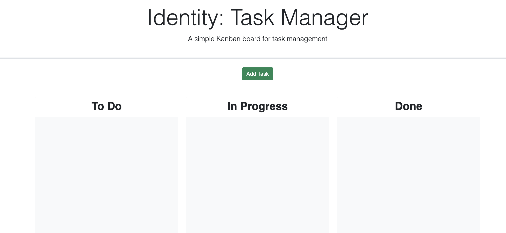

<h1> Identity </h1>
<h3> Identity is a task management tool that organizes multiple projects
through a timeline fashion. By providing a comprehensive outlook on
completed, progressing and pending projects, users can become more 
time-sensitive and efficient when collaborating with others.   </h3>

<h4> Visit us at <a href="https://scurvyirv.github.io/identity/"> Identity</a>and organize projects with ease</h4>

 
